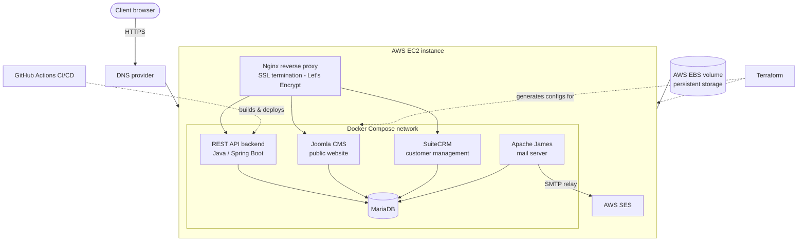

# Thusia — Email Masking Platform (Architecture Showcase)

**A fully containerized, Terraform-provisioned AWS platform for an email-masking service — built solo as a production-grade learning project.**

> The application source code lives in private repositories. This repo documents the system's architecture, infrastructure-as-code design, and the engineering decisions behind it. I'm happy to walk through the actual code in an interview.

---

## What is Thusia?

Thusia is an email-masking service: users create disposable **mask addresses** that forward to their real inbox. If a mask starts receiving spam, the user kills that mask — their real address is never exposed. One user, many masks, full control.

**Status:** Infrastructure and platform complete and deployable; product launch parked until late summer 2026.

## System architecture



Inbound mail arrives at the Apache James container, which applies the mask-forwarding rules and relays outbound mail through AWS SES. The database container is never exposed publicly; all web traffic terminates TLS at Nginx.

* The reason for using AWS SES is that AWS do not allow outbound traffic on port 25. After several time refusing my request to allow traffic on port 25, I was at the end forced to use AWS-SES for sending emails. 

## Components

| Component | Role | Notes |
|---|---|---|
| **Terraform** | Provisions all AWS resources and generates service configuration | 15+ reusable modules |
| **AWS EC2** | Compute host for the Docker stack | Amazon Linux |
| **AWS EBS** | Persistent storage, attached and mounted at provisioning | Survives instance replacement |
| **AWS SES** | Outbound mail relay | Dedicated IAM credentials |
| **Nginx** | Reverse proxy, SSL termination | Let's Encrypt certificates |
| **Apache James** | Self-hosted mail server — receives mask mail, forwards to real inboxes | SMTP/IMAP configs generated by Terraform |
| **Joomla** | CMS for the public-facing website | Custom components (separate repos) |
| **SuiteCRM** | Customer relationship management | Custom Docker image |
| **REST API** | Core backend (Java / Spring Boot) | Custom Docker image, CI/CD via GitHub Actions |
| **MariaDB** | Shared relational database | No public exposure |

## Infrastructure as Code — the interesting part

The Terraform codebase doesn't just create an EC2 instance. It treats **configuration as a first-class provisioning concern**: a library of file-generation modules renders every service's configuration from Terraform variables, so the entire stack — compose file included — is reproducible from variables alone.

```
modules/
├── AMI_gen                              # AMI selection
├── file_gen_docker_compose_yml          # renders the full docker-compose.yml
├── file_gen_nginx_nginx_conf            # reverse proxy + SSL config
├── file_gen_SSL_Agent                   # Let's Encrypt automation
├── file_gen_james_smtpserver_xml        # mail server: SMTP
├── file_gen_james_imapserver_xml        # mail server: IMAP
├── file_gen_james_mailetcontainer_xml   # mail routing/forwarding rules
├── file_gen_james_database_properties   # mail server DB wiring
├── file_gen_joomla_configuration_php    # CMS config
├── file_gen_joomla_php_ini / dot_htaccess
├── file_gen_database_init               # DB bootstrap scripts
├── file_gen_crm_initialize_sh           # CRM bootstrap
├── file_gen_etc_hosts
├── sec_grp_http_https_ssh_database      # security group module
├── sec_grp_mail_server                  # security group module (mail ports)
└── profile_gen_EC2...S3BucketAndSES     # IAM instance profile (least privilege)
```

Why this matters: changing a port, a hostname, or a database engine is a variable change, not a hunt through hand-edited config files on a server.

## CI/CD

The REST API backend builds as a custom Docker image through a **GitHub Actions** pipeline — build, test, image build, deploy. SuiteCRM also runs from a custom-built image.

## Security model

- TLS everywhere — Let's Encrypt certificates, SSL terminated at the reverse proxy
- Database container has no public exposure; access only via the internal Docker network
- Security groups defined as code, opening only required ports (HTTP/S, SSH, mail)
- IAM instance profile scoped to exactly the services needed (S3, SES)
- Secrets kept out of version control: tfvars, key files, certificates and state files are git-ignored; configuration with credentials is generated at provision time

## Design decisions & lessons learned

**Why a single EC2 instance instead of ECS/EKS?** Cost and proportionality. For a pre-launch product, a single instance with Docker Compose delivers the full containerized architecture at a fraction of the cost. The Terraform/module structure means migrating to ECS later is a contained change.

**Why self-host Apache James instead of a mail SaaS?** The mask-forwarding logic *is* the product. Owning the mail server means owning the core feature — and it was the single steepest learning curve in the project (SMTP, IMAP, mailet chains, deliverability, SES relaying). On the other hand, using Apache James allow me to move from one cloud provider to another in a shotr time but if I entirely rely on the provider's email service, it would take more effort. The reason for using AWS SES for outbound relay is that AWS does not allow outbound traffic on port 25. I was forced to use AWS-SES for sending emails.

**Why generate configs from Terraform instead of committing them?** Hand-edited configs drift, and configs with credentials don't belong in git. Generation makes the stack reproducible and keeps secrets out of history.

## Related repositories (private)

- `Thusia-awsInfra` — the Terraform codebase documented here.
- `Thusia-RestAPI` — Java/Spring Boot REST API (Dockerfile + GitHub Actions workflow).
- `Joomla-Component-Template` — Template for making a custom Joomla components for the public site.
- `JoomlaComponent_SignupForm_JV4` — custom Joomla components for the Log-in form.
- `JoomlaComponent_MaskEmailsList` — custom Joomla components for the showing the list of mask emails the user owns.
- `JoomlaComponent_NewEmailForm_JV4` — custom Joomla components that allows user to make a new mask email.

*Code walkthrough available on request.*

---

**Author:** Adam Winther — [github.com/AdmWinther](https://github.com/AdmWinther)
